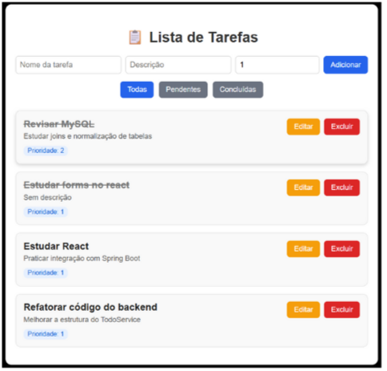
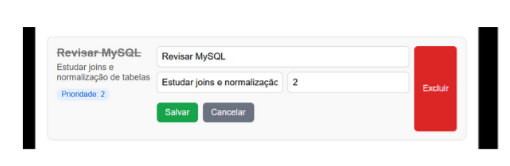

# 📝 Lista de Tarefas (ToDo List)


 
Aplicação fullstack para gerenciamento de tarefas (CRUD), desenvolvida com **Spring Boot (Java)** no backend, **React.js** no frontend e **MySQL** como banco de dados.  

---

## ⚙️ Tecnologias utilizadas

### 🔹 Backend
- [Spring Boot](https://spring.io/projects/spring-boot)  
- Spring Web  
- Spring Data JPA (Hibernate)  
- MySQL Connector  
- Maven  

### 🔹 Frontend
- [React.js](https://react.dev/)  
- Axios (requisições HTTP)  
- CSS puro para estilização  

### 🔹 Banco de dados
- MySQL 8+

---

## 🚀 Funcionalidades
- ➕ Criar uma nova tarefa  
- 📖 Listar todas as tarefas  
- ✏️ Editar nome, descrição e prioridade  
- ✅ Marcar como concluída ou reabrir  
- ❌ Excluir tarefa  
- 🔎 Filtro por **todas | pendentes | concluídas**  

---


## ⚡ Como rodar o projeto

### 🔹 Pré-requisitos
- **Java 17+**
- **Maven**
- **Node.js 18+ e npm**
- **MySQL 8+**

---

### 🔹 Backend (Spring Boot)

1. Clone o repositório:  
   ```bash
   git clone https://github.com/seu-usuario/lista-tarefas.git
   cd lista-tarefas/backend

2. Configure o banco no arquivo:
    ```bash 
    spring.datasource.url=jdbc:mysql://localhost:3306/todolist
    spring.datasource.username=SEU_USUARIO
    spring.datasource.password=SUA_SENHA
    spring.jpa.hibernate.ddl-auto=update

3. Execute a aplicação:
    ```bash 
    mvn spring-boot:run
    
4. O backend estará rodando em:
    ```bash 
    http://localhost:8080

---
🔹 Frontend (React)

1. Ir a pasta do frontend:
    ```bash 
    cd frontend

2. instalar dependências:
    ```bash
    npm install

3. Executar projeto:
    ```bash 
    npm run dev 

4. Frontend rodando em:
    ```bash
    http://localhost:5173

---
🖼️ Demonstração
---

📌 Tela principal (lista de tarefas):



- Exibe as tarefas com nome, descrição e prioridade.

- Possui botões de Editar, Excluir e Concluir/Reabrir.

- Campo de filtro (todas, pendentes, concluídas).

-- 

📌 Formulário de adicionar/editar tarefa:



- Permite inserir ou atualizar os dados da tarefa.

---
👨‍💻 Autor
---

Projeto desenvolvido por Giovani Feitosa
 
 [](https://www.linkedin.com/in/giovani-feitosa) 🚀
