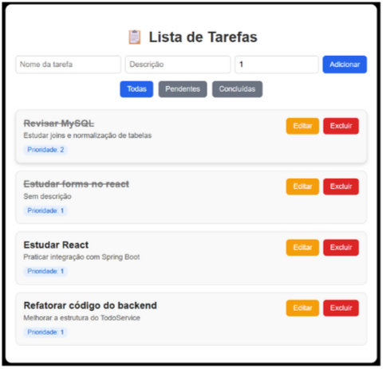
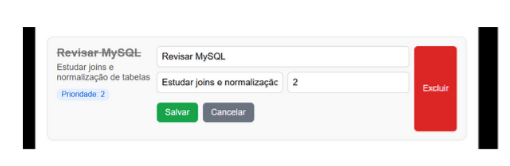

# 📝 Lista de Tarefas (ToDo List)


Aplicação fullstack para gerenciamento de tarefas (CRUD), desenvolvida com **Spring Boot (Java)** no backend, **React.js** no frontend e **PostgreSQL** como banco de dados. Conta com autenticação **JWT**, dois papéis de usuário e painel administrativo.

---

## 🌐 Deploy

| Serviço | URL |
|---|---|
| Frontend | [lista-tarefas-nine-sigma.vercel.app](https://lista-tarefas-nine-sigma.vercel.app) |
| Backend API | [lista-tarefas-e06c.onrender.com](https://lista-tarefas-e06c.onrender.com) |
| Swagger UI | [lista-tarefas-e06c.onrender.com/swagger-ui/index.html](https://lista-tarefas-e06c.onrender.com/swagger-ui/index.html) |

> ⚠️ O backend utiliza o free tier do Render, que entra em modo de hibernação após 15 minutos de inatividade. A primeira requisição após esse período pode levar até 60 segundos para responder — isso é esperado e não é um bug.

---

## ⚙️ Tecnologias utilizadas

### 🔹 Backend
- [Spring Boot](https://spring.io/projects/spring-boot)
- Spring Web
- Spring Data JPA (Hibernate)
- Spring Security
- JWT (JSON Web Token) via biblioteca jjwt
- PostgreSQL
- Maven
- Swagger / OpenAPI (springdoc)
- JUnit 5 + Mockito (testes unitários)

### 🔹 Frontend
- [React.js](https://react.dev/)
- Axios (requisições HTTP)
- CSS puro para estilização

### 🔹 Banco de dados
- PostgreSQL (produção — Render)
- MySQL 8+ (desenvolvimento local)

---

## 🚀 Funcionalidades
- ➕ Criar uma nova tarefa
- 📖 Listar todas as tarefas do usuário logado
- ✏️ Editar nome, descrição e prioridade
- ✅ Marcar como concluída ou reabrir
- ❌ Excluir tarefa
- 🔎 Filtro por **todas | pendentes | concluídas**
- 🔐 Autenticação de usuários (registro e login)
- 👥 Dois papéis de usuário: `USER` e `ADMIN`
- 🏠 Ownership de tarefas — cada usuário vê e gerencia apenas as suas próprias tarefas
- 🛡️ Painel administrativo para gerenciar usuários (exclusivo para `ADMIN`)

---

## 🔐 Autenticação e Autorização

A API utiliza autenticação via **JWT (JSON Web Token)**. Toda rota, exceto as listadas abaixo, exige um token válido.

| Papel | Permissões |
|---|---|
| `USER` | Criar, listar, editar, concluir e excluir suas próprias tarefas |
| `ADMIN` | Tudo que `USER` pode, além de gerenciar usuários (listar e excluir) |

### Endpoints públicos

| Método | Rota | Descrição |
|---|---|---|
| POST | `/api/auth/register` | Cria um novo usuário (papel `USER` por padrão) |
| POST | `/api/auth/login` | Retorna um token JWT válido por 24h |

### Usando o token

Após o login, envie o token recebido no header `Authorization` em toda requisição às rotas protegidas:

Authorization: Bearer <seu_token_aqui>

Ou utilize o botão **Authorize** no Swagger UI para testar os endpoints diretamente pelo navegador.

---

## ⚡ Como rodar o projeto localmente

### 🔹 Pré-requisitos
- **Java 17+**
- **Maven**
- **Node.js 18+ e npm**
- **MySQL 8+**

---

### 🔹 Backend (Spring Boot)

1. Clone o repositório:
```bash
git clone https://github.com/giofeitosa-dev/lista-tarefas.git
cd lista-tarefas/backend
```

2. Copie o arquivo de configuração de exemplo e preencha com suas credenciais:
```bash
cp src/main/resources/application.properties.example src/main/resources/application.properties
```
Abra o `application.properties` recém-criado e ajuste:
- `SPRING_DATASOURCE_URL`, `SPRING_DATASOURCE_USERNAME`, `SPRING_DATASOURCE_PASSWORD`: suas credenciais do banco
- `JWT_SECRET`: qualquer string aleatória com pelo menos 32 caracteres

> ⚠️ O arquivo `application.properties` não é versionado (está no `.gitignore`) por conter credenciais. Use sempre o `.example` como referência.

3. Execute a aplicação:
```bash
mvn spring-boot:run
```

4. O backend estará rodando em: `http://localhost:8080`
5. Swagger disponível em: `http://localhost:8080/swagger-ui/index.html`

---

### 🔹 Frontend (React)

1. Ir à pasta do frontend:
```bash
cd frontend
```

2. Instalar dependências:
```bash
npm install
```

3. Executar projeto:
```bash
npm run dev
```

4. Frontend rodando em: `http://localhost:5173`

> ⚠️ Para rodar localmente, altere o `baseURL` em `frontend/src/services/api.js` de volta para `http://localhost:8080`.

---

## 🧪 Testes

O projeto conta com testes unitários cobrindo toda a camada de serviço. Para rodar:

```bash
cd backend
mvn test
```

Cobertura atual: **7 testes** cobrindo `TodoService` — listagem, criação, edição e exclusão de tarefas, incluindo cenários de acesso negado.

---

## 🖼️ Demonstração

📌 Tela principal (lista de tarefas):



- Exibe as tarefas com nome, descrição e prioridade.
- Possui botões de Editar, Excluir e Concluir/Reabrir.
- Campo de filtro (todas, pendentes, concluídas).

---

📌 Formulário de adicionar/editar tarefa:



- Permite inserir ou atualizar os dados da tarefa.

---

## 👨‍💻 Autor

Projeto desenvolvido por Giovani Feitosa

[](https://www.linkedin.com/in/giovani-feitosa) 🚀